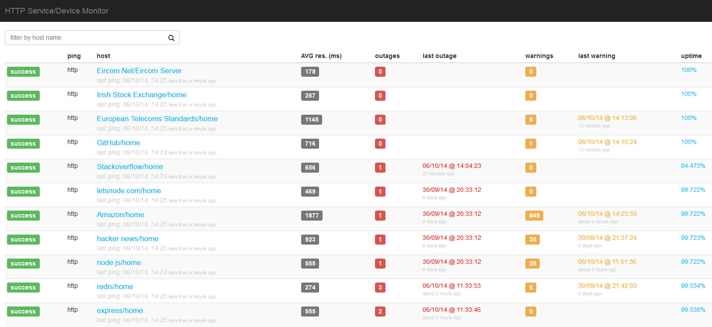
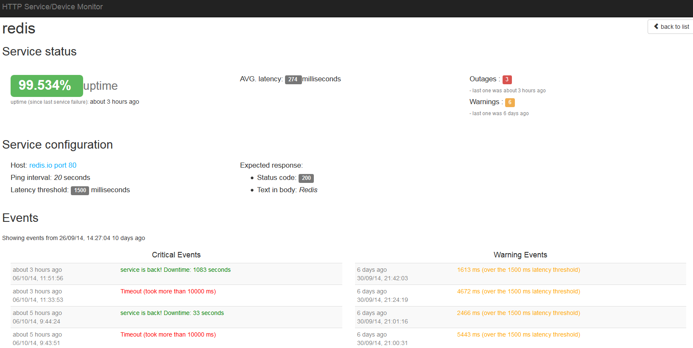

## A HTTP(S) service/device monitor.
###Built using Node, Angular and Redis###

* Monitor HTTP(S) service/device health 
* Displays outages, uptime, response time, warnings, avg. response time and more

This program is based on the blog: [Example of what Node.js is really good at: a single threaded HTTP monitor](http://letsnode.com/example-of-what-node-is-really-good-at) by [Ivan Loire](https://github.com/iloire/WatchMen).

Here is a [demo](http://watchmen.letsnode.com/) of Ivans Program.

Please refer to Ivans README and License contained in <pre> /watchmen </pre>

## App Specifics

I removed the handlebars and ejs code along with the server side rendering of views.
Updated Express and added an AngularJS front end with client side rendering of views.

The services to be monitored are located in the file:
<pre>/watchmen/config/hosts.js</pre>

The program comes in two separate parts. 

1. The _watchmen_ part does all the heavy lifting. I did not alter this code except to change Redis to default port 6379. 
	This code pings the HTTP(S) hosts to obtain connection status. Performs calculations to discern uptime, response time, warnings, avg. response time. Connects to and Redis DB and saves data there.

2. The _webserver_ part - Angular Client which performs regular $http polling to retrieve device status information and renders it on a browser.

 

## Running the App

- run Redis (program uses default port 6379)
- clone the repository

PART 1
- open a terminal window
- cd _watchmen_
- npm install
- node server

PART 2
- open another terminal window
- cd _webserver_
- npm install
- bower install
- node server.js
- browse to 'http://localhost:3000'

## Screen Shots

		

		

Michael Cullen 2014

